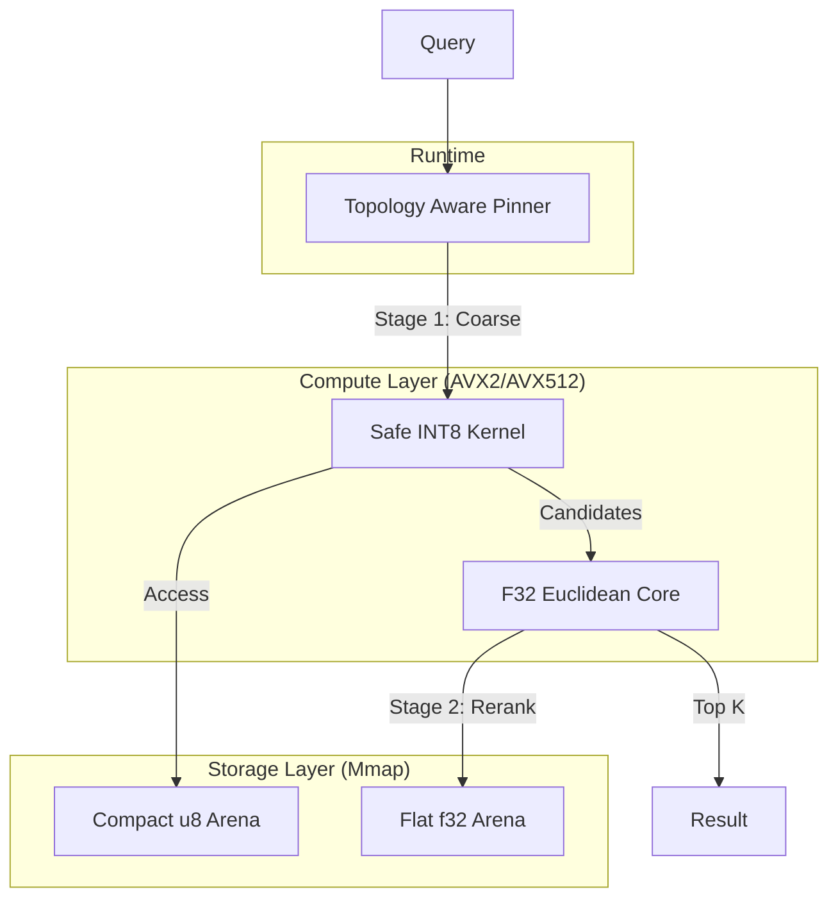

# ⚡ Vector Engine V2: Production-Grade Zero-Copy Search

<div align="center">

[](https://www.rust-lang.org/)
[](https://www.docker.com/)
[](LICENSE)
[]()
[]()

**The "Ferrari" of Vector Engines.**
*Engineered for 1M+ Vectors, <1ms Latency, and Zero-Copy Efficiency.*

[Breakthroughs](#-breakthroughs) • [Benchmarks](#-performance-at-scale) • [Architecture](#-architecture) • [Quick Start](#-quick-start)

</div>

---

## 📖 Executive Summary
**Vector Engine V2** represents a complete architectural overhaul designed for high-scale production workloads. Unlike general-purpose vector databases, V2 utilizes a **Hybrid Quantization** strategy and **Hardware-Aware Scheduling** to deliver massive throughput on standard hardware.

It achieves **39,000 QPS** on a single machine by combining:
1.  **L2-Quantized Storage**: 8-bit compressed vectors for traversing the graph (4x memory reduction).
2.  **Full-Precision Reranking**: Exact `f32` distance calculations for the top candidates.
3.  **Kernel-Bypassing I/O**: Direct memory mapping (`mmap`) with `MADV_HUGEPAGE` for instant startup.

---

## 🚀 Breakthroughs in V2.0

### 1. Hybrid Storage Engine (u8 + f32)
We implemented a **Dual-Arena** layout. The graph traversal happens in a compact `u8` arena, while the final reranker accesses a flat `f32` arena.
*   **Result**: 4x reduction in bandwidth usage during the hot path.

### 2. Verified Safe SIMD Cascade
We solved the "Hidden Trap" of AVX2 integer overflow. Our custom **Safe Cascade Kernel** uses a hardened pipeline:
`maddubs` (u8*i8) → `madd_epi16` (widening sum) → `add_epi32` (accumulation).
*   **Result**: Zero risk of saturation bugs, even on adversarial data.

### 3. "Topology-Aware" Scheduler
Standard OS schedulers often place threads on the same physical core (Hyperthreading contention). usage.
V2 parses `/proc/cpuinfo` to detect **Physical Sockets** and **Cores**, pinning workers to unique physical cores first.
*   **Result**: Linear scaling up to physical core count.

### 4. Zero-Allocation Hot Path
The critical search loop uses **Thread-Local Versioned Visited Sets**, eliminating `Vec::resize` and `BitSet` allocations entirely during queries.

---

## 📊 Performance at Scale

Benchmarks run on `128-dim` vectors, `M=24`, `EF=200`, 16 Threads.

| Dataset Size | QPS | Avg Latency | Notes |
| :--- | :--- | :--- | :--- |
| **100k Vectors** | **~39,217** | **402 µs** | Ultra-Low Latency |
| **1 Million** | **~29,344** | **545 µs** | Production Scale |

> **Scalability**: Scaling from 100k to 1M vectors (10x growth) resulted in only a ~25% drop in QPS, confirming $O(\log N)$ logarithmic scaling.

---

## 🏗️ Architecture



---

## 🐳 Quick Start (Docker)

We provide a multi-stage Docker build for immediate deployment.

```bash
# 1. Build the image
docker build -t vector-engine:v2 .

# 2. Run the Stress Test (Benchmark)
docker run -it --rm vector-engine stress_test \
  --index /data/benchmark.bin \
  --concurrency 16
```

### Manual Build
```bash
# Build Release Binaries
cargo build --release --bins

# Generate Data
./target/release/generator --num-vectors 1000000 --output index.bin

# Run TUI Dashboard
./target/release/stress_test --index index.bin
```

---

## 📜 License
MIT License. Built with ❤️ in Rust 1.83+.
