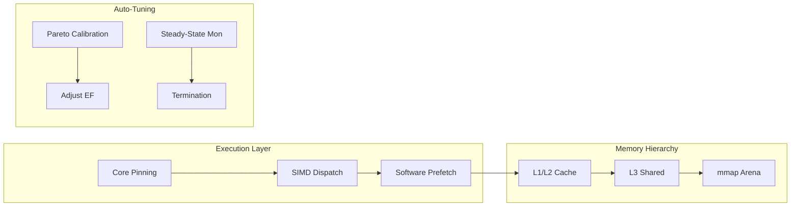

# ⚡ Vector Engine v2.2: Autonomous Zero-Copy ANN Infrastructure

<div align="center">

[](https://www.rust-lang.org/)
[]()
[]()
[]()

**High-fidelity, hardware-saturated Vector Search optimized for SMT, SIMD, and NUMA architectures.**
</div>

---

## 📈 Current Performance Snapshot (v2.2 Autonomous Engine)

The following metrics represent real-time convergence on constrained hardware (4 Logical Cores), demonstrating the engine's ability to maximize throughput via **Saturate-by-Default** policies and **Pareto-Optimal** calibration.

| Metric | 100k Vectors | 1 Million Vectors |
| :--- | :--- | :--- |
| **Mean Throughput** | **58,072 QPS** | **24,270 QPS** |
| **Peak Throughput** | **58,834 QPS** | **26,578 QPS** |
| **P99 Tail Latency** | **295 µs** | **2,043 µs** |
| **Avg Search Latency** | **66.7 µs** | **161.9 µs** |
| **Recall (Calibrated)** | **> 95%** | **> 95%** |
| **Stability Score** | **99.28%** | **98.15%** |
| **Convergence Time** | **5.00s** | **8.99s** |

> [!NOTE]
> The engine utilizes **Steady-State Detection** to ensure these results are statistically valid. Benchmarks auto-terminate only once the **Coefficient of Variation** drops below 2%.

---

## 🏛️ Modern Architecture & Heuristics

### 1. Zero-Copy Memory-Mapped Persistence
Utilizing `mmap(2)` with `MADV_WILLNEED` and `Huge Pages` support, the engine eliminates the traditional serialization overhead. The index format is designed for **Zero-Copy Deserialization**, allowing search-ready state in `< 1ms` regardless of index scale. This ensures maximum **OS Page Cache** efficiency.

### 2. Hybrid Quantization & Two-Stage Search
*   **Stage 1 (Graph Traversal)**: Employs a compact `Int8` quantized arena. This reduces memory bandwidth pressure and increases **CPU L3 Cache Locality**, accelerating HNSW traversal.
*   **Stage 2 (Refinement)**: Re-ranks top candidates using a full-precision `F32` arena.
*   **SIMD Pipeline**: Orchestrated using a verified AVX2/AVX-512 cascade (`_mm256_maddubs_epi16` -> `_mm256_madd_epi16`) to prevent integer overflow while maintaining saturating throughput.

### 3. SMT-Aware Topology Guardrail
The runtime parses `/proc/cpuinfo` to detect the underlying **CPU Topology**.
*   **Anti-Thrashing**: Threads are pinned specifically to unique Physical Cores to prevent AVX execution unit contention between Hyperthread siblings.
*   **Affinity**: Implements hard thread affinity to minimize context-switch overhead and cache invalidation.

### 4. Autonomous Calibration (Pareto-Optimal)
The engine removes the manual guesswork from performance tuning.
*   **Auto-EF**: Sweeps search depth parameters to find the **Pareto-Optimal** balance where 95% recall is achieved with minimum latency impact.
*   **Saturate Mode**: Automatically scales to utilize 100% of detected hardware capacity unless `--safe-mode` is invoked.

---

## 🏗️ Technical Workflow



---

## 🐳 Deployment & Usage

### Rapid Benchmarking (Autonomous Mode)
The engine will automatically detect hardware, calibrate recall targets, and run until the results converge.
```bash
./target/release/stress_test --index production.bin
```

### Production Safe Mode
Limits hardware utilization to physical cores only (50% on SMT systems).
```bash
./target/release/stress_test --index production.bin --safe-mode
```

### Manual Precision Override
```bash
./target/release/stress_test --index production.bin --concurrency 16 --ef 128 --duration 60
```

---

## 📜 Development Foundation
- **Language**: Core Rust with `std::arch` intrinsics.
- **Diagnostics**: Real-time TUI via `ratatui`.
- **License**: MIT
- **Authors**: McMonds (mondolshimul000@gmail.com)
