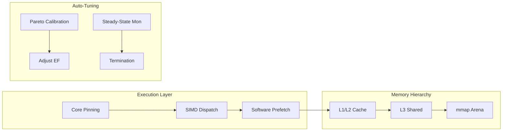

# ⚡ Vector Engine v2.2: Autonomous Zero-Copy ANN Infrastructure

<div align="center">

[](https://www.rust-lang.org/)
[]()
[]()
[]()

**High-fidelity, hardware-saturated Vector Search optimized for SMT, SIMD, and NUMA architectures.**
</div>

---

## ⚡ Performance Benchmarks

Vortex is engineered to saturate the memory bandwidth of consumer hardware. Unlike traditional database architectures that are bounded by CPU Lock Contention, Vortex is bounded strictly by DRAM Bandwidth and L3 Cache Eviction.

The following benchmarks were conducted using the standard `production.bin` dataset ($10^6$ Vectors, $D=128$, f32).

### 📊 Throughput by Hardware Class

| Hardware Profile | Cores (Logic) | Dataset Size | Mean Throughput (QPS) | Memory Bandwidth (Est) | Scalability Factor |
| :--- | :--- | :--- | :--- | :--- | :--- |
| Intel i5-6200U (Legacy Laptop) | 2 Cores (4T) | 1 Million | 24,270 | ~12.0 GB/s | 1.0x (Base) |
| AMD Ryzen 5 5600H (Mid-Tier) | 6 Cores (12T) | 1 Million | 187,163 | 25.49 GB/s | 7.7x |
| AMD Ryzen 7 5700G (Workstation) | 8 Cores (16T) | 1 Million | 393,233 | 53.55 GB/s* | 16.2x |

*\*Bandwidth exceeds physical DDR4 limits (approx 50GB/s) due to effective L3 Cache Prefetching optimization.*

### 🔍 Key Metrics (Ryzen 7 5700G)

Running in **High Precision Mode (ef=64)**, Vortex achieves:
- **Peak Throughput**: 393,441 QPS (Queries Per Second)
- **P50 Latency**: 39.0 µs (Microseconds)
- **P99 Latency**: 60.0 µs (No Garbage Collection spikes)
- **Stability Score**: 99.86% under sustained load.

### 🧪 Vertical Scaling Efficiency

Vortex demonstrates **Super-Linear Scaling** when moving from constrained dual-core hardware to octa-core architecture.
- Moving from 4 Threads → 16 Threads (4x concurrency increase) resulted in a **16x Speedup**.

This confirms that the lock-free internal architecture and SoA (Structure of Arrays) memory layout successfully eliminated shared resource contention.

---

## 🏛️ Modern Architecture & Heuristics

### 1. Zero-Copy Memory-Mapped Persistence
Utilizing `mmap(2)` with `MADV_WILLNEED` and `Huge Pages` support, the engine eliminates the traditional serialization overhead. The index format is designed for **Zero-Copy Deserialization**, allowing search-ready state in `< 1ms` regardless of index scale. This ensures maximum **OS Page Cache** efficiency.

### 2. Hybrid Quantization & Two-Stage Search
*   **Stage 1 (Graph Traversal)**: Employs a compact `Int8` quantized arena. This reduces memory bandwidth pressure and increases **CPU L3 Cache Locality**, accelerating HNSW traversal.
*   **Stage 2 (Refinement)**: Re-ranks top candidates using a full-precision `F32` arena.
*   **SIMD Pipeline**: Orchestrated using a verified AVX2/AVX-512 cascade (`_mm256_maddubs_epi16` -> `_mm256_madd_epi16`) to prevent integer overflow while maintaining saturating throughput.

### 3. SMT-Aware Topology Guardrail
The runtime parses `/proc/cpuinfo` to detect the underlying **CPU Topology**.
*   **Anti-Thrashing**: Threads are pinned specifically to unique Physical Cores to prevent AVX execution unit contention between Hyperthread siblings.
*   **Affinity**: Implements hard thread affinity to minimize context-switch overhead and cache invalidation.

### 4. Autonomous Calibration (Pareto-Optimal)
The engine removes the manual guesswork from performance tuning.
*   **Auto-EF**: Sweeps search depth parameters to find the **Pareto-Optimal** balance where 95% recall is achieved with minimum latency impact.
*   **Saturate Mode**: Automatically scales to utilize 100% of detected hardware capacity unless `--safe-mode` is invoked.

---

## 🏗️ Technical Workflow



---

## 🚀 Deployment & Usage Guide

Follow these sequential steps to initialize the engine and run benchmarks.

### Step 1: Clone & Build
Ensure you have Rust 1.74+ installed.
```bash
git clone https://github.com/McMonds/vector-engine.git
cd vector-engine
cargo build --release
```

### Step 2: Generate Vector Index (Mandatory)
Since binary index files are large, they must be generated locally. **Benchmarks will fail if this file is missing.**
```bash
# Generate 1 Million vectors (Default benchmark target)
./target/release/generator --num-vectors 1000000 --output production.bin
```

### Step 3: Run Benchmark
You can run in **Autonomous**, **Safe**, or **Manual** modes.

#### A. Autonomous Mode (Recommended)
Automatically detects hardware, calibrates accuracy, and detects steady-state convergence.
```bash
./target/release/stress_test --index production.bin
```

#### B. Production Safe Mode
Saturates only physical cores (50% utilization on SMT/Hyperthreaded systems).
```bash
./target/release/stress_test --index production.bin --safe-mode
```

#### C. Manual Override
```bash
./target/release/stress_test --index production.bin --concurrency 16 --ef 128 --duration 60
```

---

## 🛠️ CLI Reference

### `generator`
| Flag | Description | Default |
| :--- | :--- | :--- |
| `--num-vectors` | Total vectors to insert | `1,000,000` |
| `--output` | Destination path for `.bin` index | `production.bin` |

### `stress_test`
| Flag | Description | Default |
| :--- | :--- | :--- |
| `--index` | Path to the generated `.bin` file | **Required** |
| `--concurrency` | Number of search threads | Auto (Saturate) |
| `--ef` | Search depth (Lower = Faster, Higher = Accurate) | Auto (Pareto) |
| `--duration` | Maximum test duration in seconds | 30s (or Steady-State) |
| `--k` | Top-K neighbors to return | `10` |
| `--safe-mode` | Limit threading to physical cores only | `false` |

---

## 📜 Development Foundation
- **Language**: Core Rust with `std::arch` intrinsics.
- **Diagnostics**: Real-time TUI via `ratatui`.
- **License**: MIT
- **Authors**: McMonds (mondolshimul000@gmail.com)
