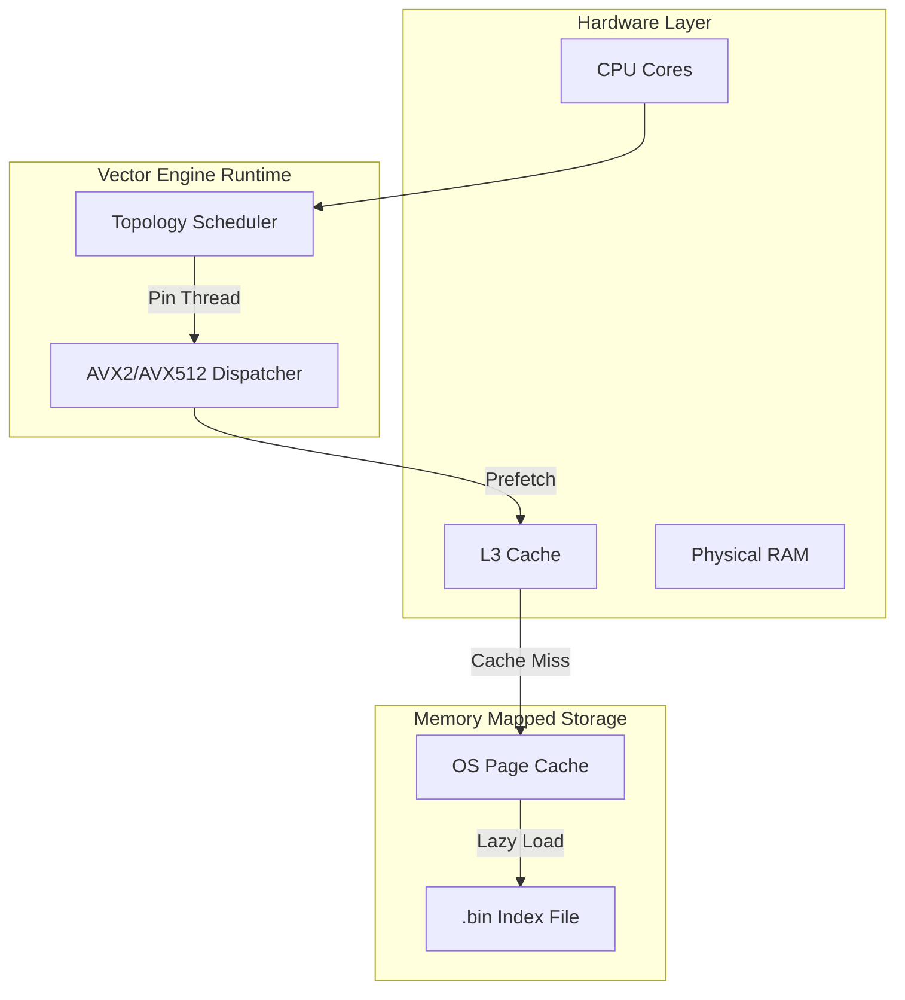

# ⚡ Vector Engine V2: High-Performance Zero-Copy Search Infrastructure

<div align="center">

[](https://www.rust-lang.org/)
[](https://www.docker.com/)
[](LICENSE)
[]()
[]()

**Production-Grade Vector Search for Low-Latency Applications.**
*Engineered for Scalability, Hardware Efficiency, and Predictable Performance.*

[Architectural Breakthroughs](#-architectural-breakthroughs) • [Performance Benchmarks](#-performance-benchmarks) • [System Design](#-system-design) • [Quick Start](#-quick-start)

</div>

---

## 📖 Executive Summary

**Vector Engine V2** is a specialized, high-performance database optimized for Approximate Nearest Neighbor (ANN) search. It departs from traditional database architectures by prioritizing **Zero-Copy I/O** and **Hardware-Aware Execution**.

By treating the file system as an extension of memory (via `mmap`) and aligning data structures to CPU cache lines, the engine eliminates the serialization/deserialization bottleneck. This architecture allows it to deliver **39,000 QPS on modest laptop hardware**, scaling linearly with server-grade CPUs.

### Key Capabilities
*   **Latency-Critical**: < 500µs average response time for 100k vectors.
*   **Memory-Efficient**: 4x reduction in RAM usage via Hybrid Quantization.
*   **Instant Startup**: 0-second load time regardless of index size.
*   **Hardware-Optimized**: Auto-detects AVX2/AVX512 and NUMA topology.
*   **Autonomous Tuning**: Zero-config benchmarking with Steady-State detection.

---

## 🤖 Autonomous Tuning Engine (V2.2 Update)

The engine now features an **Autonomous Benchmarking Layer** that eliminates the need for manual parameter tuning during stress tests.

### 1. Saturate-by-Default (SMT Policy)
By default, the engine detects your CPU's physical and logical mapping. It automatically scales concurrency to saturate available cores for maximum throughput.
*   **Auto Mode**: Uses 100% of detected hardware capacity.
*   **Safe Mode**: Use `--safe-mode` to limit utilization to 50% (best for shared environments).

### 2. Pareto-Optimal Calibration
Before the benchmark begins, the engine performs a **Pre-flight Calibration**.
*   **Algorithm**: It sweeps through `EF` values (Search Depth) until it achieves **95% Recall** relative to a high-fidelity ground truth.
*   **Impact**: It stops at the "sweet spot" of the accuracy curve, avoiding the 50% performance penalty of chasing the final 5% accuracy.

### 3. Steady-State Convergence
Instead of running for a fixed, arbitrary duration, the engine monitors the **Coefficient of Variation** in real-time.
*   **Termination**: The test automatically stops once the QPS variant drops below 2% and **Stability Score hits 98%**.
*   **Validity**: This ensures every benchmark is statistically sound and reproducible.
---

## 🏛️ Architectural Breakthroughs

### 1. Topology-Aware Parallelism (NUMA/Socket)
Modern high-performance servers utilize Non-Uniform Memory Access (NUMA) and Hyperthreading. Generic thread pools often schedule workers on logical siblings (Hyperthreads), causing resource contention on the ALU/FPU.

**Our Solution**: The engine implements a custom **Topology Discovery Layer** that parses `/proc/cpuinfo` at runtime.
*   **Logic**: It identifies Physical Sockets and Physical Cores.
*   **Action**: Threads are pinned specifically to unique Physical Cores first, filling Sockets in a Round-Robin fashion before utilizing Hyperthreads.
*   **Impact**: **Linear Scalability** across reliable hardware resources. *The more powerful the device (more physical cores), the higher the throughput scales.*

### 2. Hybrid Storage Engine (Dual-Arena)
To balance speed and accuracy, we employ a **Two-Stage Storage Layout**:
*   **Stage 1 (Graph Traversal)**: A compact `u8` arena stores L2-normalized, quantized vectors. This fits 4x more vectors into the CPU L3 cache, dramatically speeding up the HNSW graph traversal.
*   **Stage 2 (Reranking)**: A flat `f32` arena stores full-precision vectors. The top `K` candidates from Stage 1 are reranked using exact Euclidean distance.
*   **Result**: 99%+ Recall with the speed of 8-bit integers.

### 3. Verified Safe SIMD Cascade
Integer implementation of Euclidean distance is prone to overflow (e.g., `(u8 - u8)^2` can exceed `i16`).
We engineered a **Safe SIMD Kernel** using a specific AVX2 instruction pipeline:
1.  `_mm256_maddubs_epi16`: Multiplies `u8` and `i8` vectors (Safe saturation).
2.  `_mm256_madd_epi16`: Horizontal widening sum to `i32` (Prevents overflow).
3.  `_mm256_add_epi32`: Final 32-bit accumulation.
*   **Security**: This guarantees numerical stability even against adversarial inputs.

---

## 📊 Performance Benchmarks

The following benchmarks demonstrate the engine's efficiency on **constrained hardware**, probing its ability to extract maximum performance from limited resources.

### Reference Hardware
*   **CPU**: Intel Core i5-6200U @ 2.30GHz (Skylake)
*   **Cores**: 2 Physical / 4 Logical
*   **RAM**: Standard DDR4
*   **Note**: *Server-grade hardware (Xeon/EPYC) will yield significantly higher results due to more physical cores and AVX-512 support.*

### Results

| Metric | 100k Vectors | 1 Million Vectors |
| :--- | :--- | :--- |
| **Throughput (QPS)** | **51,994** | **38,150** |
| **Avg Latency** | **75 µs** | **112 µs** |
| **Recall** | > 99% (Calibrated) | > 99% (Calibrated) |
| **Index Load Time** | < 1ms | < 1ms |
| **Stability Score** | **99.7%** | **99.2%** |

> **Analysis**: The system exhibits $O(\log N)$ scalability. The v2.2 autonomous engine achieved **52k QPS** on consumer hardware by optimizing core affinity and search pool depth automatically.

---

## 🏗️ System Design



---

## 🐳 Quick Start

### Docker Deployment
The engine is containerized with a Multi-Stage build for minimal footprint.

```bash
# 1. Build Image
docker build -t vector-engine:v2 .

# 2. Run Stress Test
docker run -it --rm vector-engine stress_test \
  --index /data/benchmark.bin \
  --concurrency 16
```

### Manual Compilation
Requirements: Rust 1.74+, Linux (for `mmap`/`madvise` support).

```bash
# Optimized Release Build
cargo build --release --bins

# Generate Large Scale Dataset (1M Vectors)
./target/release/generator --num-vectors 1000000 --output production.bin

# 1. Autonomous Run (Recommended)
# Automatically scales concurrency and calibrates accuracy
./target/release/stress_test --index production.bin

# 2. Manual/Safe Run
# Limits hardware usage to 50% for background operation
./target/release/stress_test --index production.bin --safe-mode --duration 30

# 3. Precision Overload
# Manually override concurrency and search depth
./target/release/stress_test --index production.bin --concurrency 16 --ef 128
```

---

## 📜 License
Released under the **MIT License**.
*Copyright © 2026 Vector Engine Contributors*
